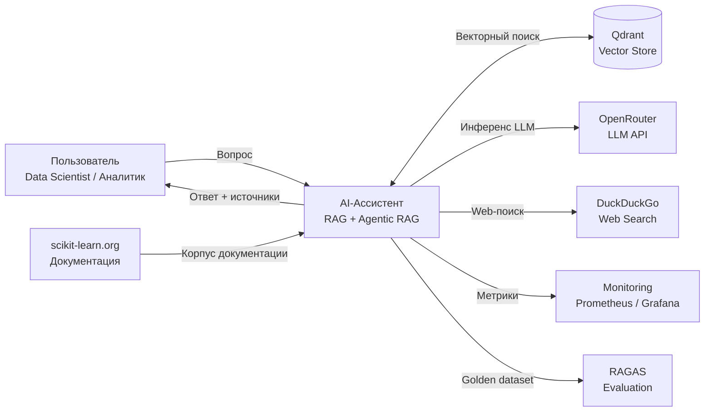
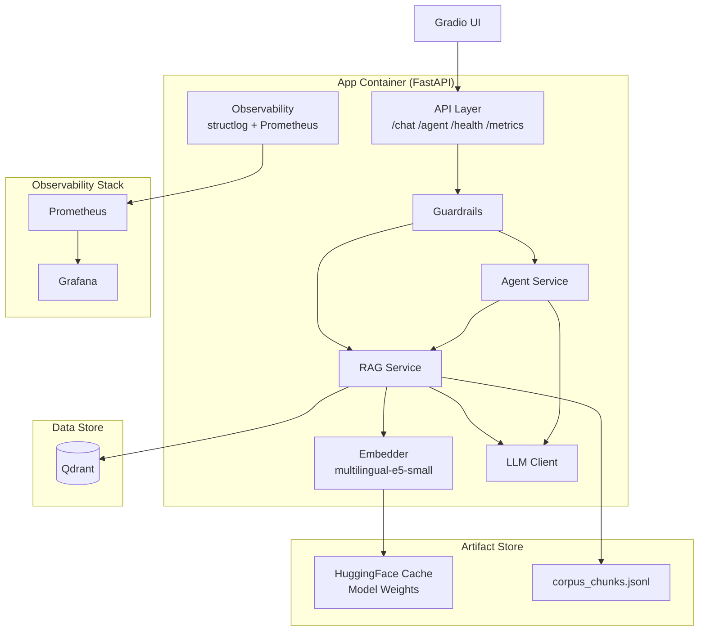
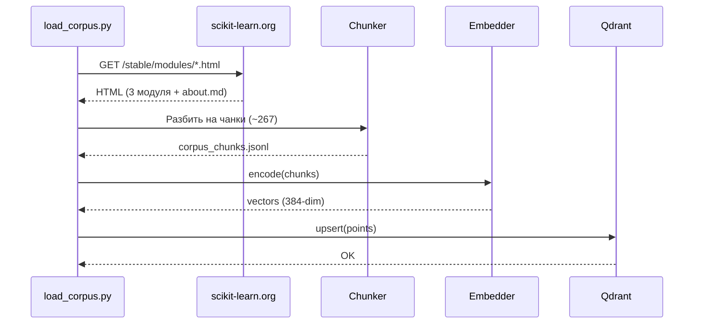
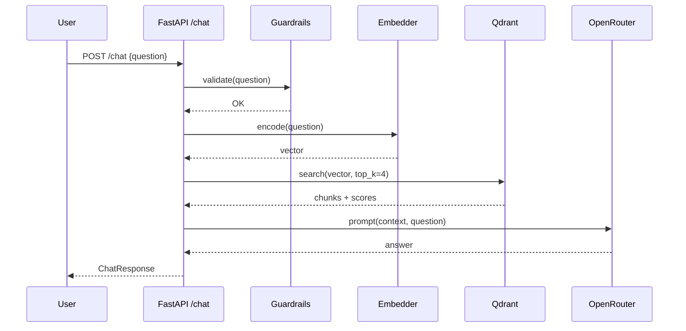
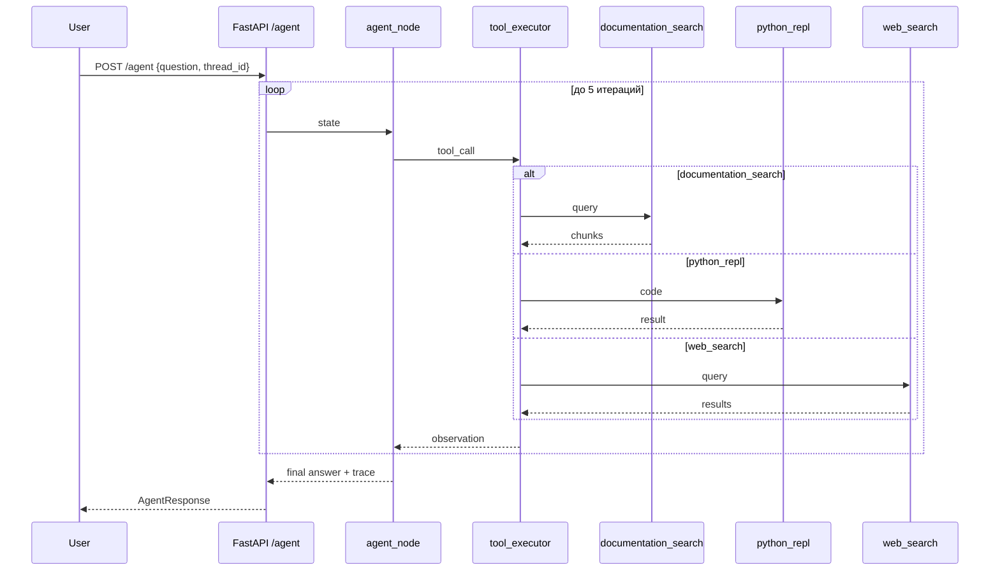
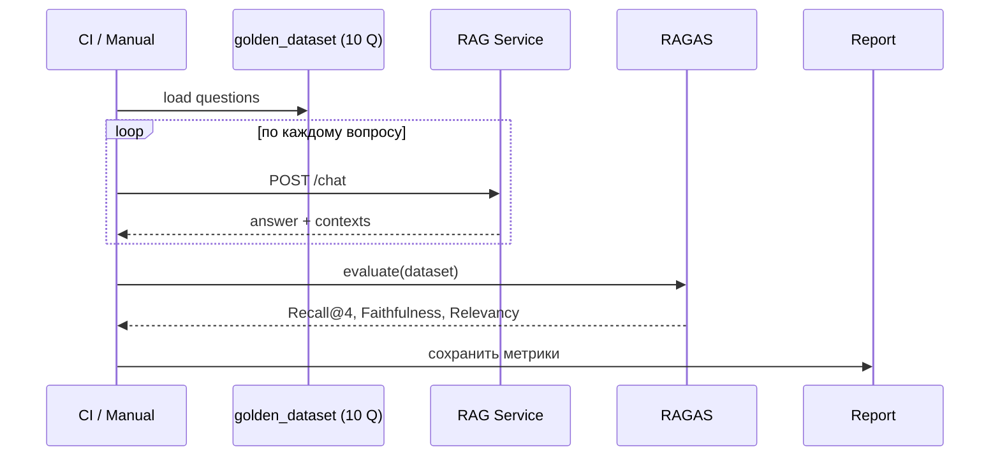

# AI-Ассистент для команды Data Science по документации scikit-learn

Внутренний AI-ассистент, который сокращает время поиска информации по машинному обучению с 10–15 минут до 5–10 секунд. Система построена на базе RAG (Retrieval-Augmented Generation) над документацией scikit-learn и расширена LangGraph-агентом с ReAct-циклом.

---

## Содержание

1. [Бизнес-проблема и прикладной кейс](#1-бизнес-проблема-и-прикладной-кейс)
2. [Пользователи, внешние системы и Use Cases](#2-пользователи-внешние-системы-и-use-cases)
3. [Класс задач AI и целевые метрики](#3-класс-задач-ai-и-целевые-метрики)
4. [Архитектурный стиль](#4-архитектурный-стиль)
5. [Компонентная декомпозиция](#5-компонентная-декомпозиция)
6. [Контекстная и компонентная диаграммы](#6-контекстная-и-компонентная-диаграммы)
7. [Спецификация REST API](#7-спецификация-rest-api)
8. [Сквозные потоки данных](#8-сквозные-потоки-данных)
9. [Architecture Decision Records](#9-architecture-decision-records)
10. [Безопасность, наблюдаемость, защита от дрейфа](#10-безопасность-наблюдаемость-защита-от-дрейфа)

---

## 1. Бизнес-проблема и прикладной кейс

### Прикладной кейс

Трек **Enterprise RAG** с элементами трека **Smart Helpdesk**: внутренний AI-ассистент для команды Data Science, отвечающий на вопросы по документации scikit-learn.

### Бизнес-проблема

Специалисты по данным тратят **10–15 минут** на поиск нужной информации в документации scikit-learn: переключение между вкладками, чтение длинных страниц, поиск примеров использования API. Это снижает продуктивность и увеличивает time-to-solution для ML-задач.

### Бизнес-цель

Сократить время поиска информации по ML с **10–15 минут до 5–10 секунд** за счёт:

- семантического поиска по корпусу документации (RAG);
- генерации готового ответа с указанием источников;
- возможности выполнить вычисление и найти свежую информацию через агента.

### Конечные потребители

- **Data Scientist** — основной пользователь, ищет API, примеры, параметры моделей.
- **Аналитик** — уточняет метрики, методы оценки, статистические детали.
- **Руководитель** — получает быстрые сводки по возможностям библиотеки.

---

## 2. Пользователи, внешние системы и Use Cases

### Пользователи

| Роль | Потребность |
|------|-------------|
| Data Scientist | Быстрый доступ к API, примерам, параметрам моделей scikit-learn |
| Аналитик | Понимание метрик, методов оценки, статистических деталей |

### Внешние системы

| Система | Назначение | Протокол |
|---------|-----------|----------|
| scikit-learn.org | Источник корпуса документации | HTTPS |
| Qdrant | Векторное хранилище эмбеддингов | gRPC / REST |
| OpenRouter | LLM-инференс (OpenAI-совместимый API) | HTTPS |
| DuckDuckGo | Web-поиск свежей информации | HTTPS |

### Use Cases

| ID | Use Case | Актор | Описание |
|----|----------|-------|----------|
| UC-01 | Задать вопрос по документации | Data Scientist, Аналитик | Пользователь задаёт вопрос, получает ответ с источниками через `/chat` |
| UC-02 | Выполнить вычисление | Data Scientist | Агент выполняет Python-код через `python_repl` |
| UC-03 | Найти свежую информацию | Data Scientist | Агент ищет в интернете через `web_search` |
| UC-04 | Получить пошаговый журнал | Data Scientist | Пользователь видит `trace` вызовов инструментов через `/agent` |

---

## 3. Класс задач AI и целевые метрики

### Класс задач

- **RAG (Retrieval-Augmented Generation)** — базовый режим: семантический поиск + генерация ответа.
- **Agentic RAG (ReAct)** — расширенный режим: LLM-агент с инструментами и циклом рассуждений.

### Метрики модели

| Метрика | Целевое значение | Инструмент |
|---------|------------------|------------|
| Recall@4 | ≥ 0.80 | RAGAS |
| Faithfulness | ≥ 0.75 | RAGAS |
| Response Relevancy | ≥ 0.75 | RAGAS |
| Tool-choice accuracy | ≥ 0.80 | Ручная разметка |

### Метрики SLA

| Метрика | Целевое значение |
|---------|------------------|
| `/chat` p95 latency | < 7 сек |
| `/agent` p95 latency | < 20 сек |
| TTFT (time-to-first-token) | < 1 сек |
| Доступность | 99.9% |

### Требования FR / NFR

| ID | Тип | Требование |
|----|-----|-----------|
| FR-01 | Функциональное | Система принимает вопрос пользователя и возвращает ответ с источниками через `POST /chat` |
| FR-02 | Функциональное | Система поддерживает агентный режим с инструментами через `POST /agent` и возвращает `trace` |
| FR-03 | Функциональное | Система предоставляет эндпоинт `GET /health` для проверки работоспособности |
| FR-04 | Функциональное | Система предоставляет эндпоинт `GET /metrics` в формате OpenMetrics |
| FR-05 | Функциональное | Система выполняет guardrails на входе и выходе (prompt injection, длина, allowed chars) |
| NFR-01 | Нефункциональное | `/chat` p95 < 7 сек, `/agent` p95 < 20 сек |
| NFR-02 | Нефункциональное | Доступность 99.9% |
| NFR-03 | Нефункциональное | Structured logging (structlog JSON) со всеми ключевыми полями |
| NFR-04 | Нефункциональное | Метрики Prometheus: `http_requests_total`, `http_request_duration_seconds`, `model_inference_duration_seconds` |

---

## 4. Архитектурный стиль

### Выбранный стиль

**Модульный монолит** в едином Docker-контейнере `app` + отдельный контейнер `Qdrant`.

### Обоснование

- Команда небольшая, домен единый (RAG + агент).
- Модульная структура (`app/api`, `app/services`, `app/rag`, `app/agent`) обеспечивает слабую связанность.
- Единый деплой упрощает CI/CD и локальную разработку.
- Qdrant вынесен отдельно как stateful-компонент с собственным жизненным циклом.

### Рассмотренные альтернативы

| Альтернатива | Причина отказа |
|--------------|----------------|
| Микросервисы | Избыточная сложность для одного домена; сетевые накладные расходы; усложнение отладки |
| Event-driven | Нет требований к асинхронной обработке; синхронный REST достаточен для SLA |

Подробнее — в [ADR-03](docs/adr/ADR-03.md).

---

## 5. Компонентная декомпозиция

### Модули

| Модуль | Назначение |
|--------|-----------|
| `app/api/` | Pydantic-схемы, роуты FastAPI |
| `app/core/` | Конфигурация, логирование |
| `app/data/` | Загрузка корпуса, чанкинг |
| `app/ml/` | Эмбеддер, LLM-клиент |
| `app/services/` | Бизнес-логика (RAG-цепочка, агент) |
| `app/repositories/` | Персистентность (БД, Qdrant) |
| `app/rag/` | LCEL-цепочка |
| `app/agent/` | Tools, graph, prompts, guardrails |
| `app/schemas/` | Pydantic-схемы запросов/ответов |
| `app/scripts/` | Утилиты (load_corpus, index_corpus) |

### Таблица компонентов

| Компонент | Назначение | Вход | Выход | Библиотеки |
|-----------|-----------|------|-------|-----------|
| API Layer | HTTP-эндпоинты, валидация | HTTP-запрос | HTTP-ответ | FastAPI, Pydantic v2 |
| RAG Service | Оркестрация RAG-цепочки | Вопрос | Ответ + источники | LangChain (LCEL) |
| Agent Service | ReAct-цикл с инструментами | Вопрос | Ответ + trace | LangGraph |
| Embedder | Векторизация текста | Текст | Вектор 384-dim | sentence-transformers |
| LLM Client | Инференс LLM | Промпт | Текст | OpenRouter API |
| Vector Store | Хранение и поиск эмбеддингов | Вектор | Top-K чанков | Qdrant |
| Guardrails | Валидация входа/выхода | Текст | Текст / ошибка | re, Pydantic |
| Observability | Логи, метрики, трейсы | События | JSON-логи, метрики | structlog, prometheus-client |
| UI | Чат-интерфейс | Действия пользователя | Ответ, тайминги, источники | Gradio |

---

## 6. Контекстная и компонентная диаграммы

### C4 Level 1: System Context



### C4 Level 2: Container / Component



---

## 7. Спецификация REST API

### `POST /chat`

**Pydantic-схемы:**

```python
from pydantic import BaseModel, Field


class Source(BaseModel):
    title: str = Field(..., description="Заголовок источника")
    url: str = Field(..., description="URL источника")
    score: float = Field(..., ge=0.0, le=1.0, description="Релевантность")


class ChatRequest(BaseModel):
    question: str = Field(..., min_length=1, max_length=2000)
    top_k: int = Field(4, ge=1, le=10)


class ChatResponse(BaseModel):
    answer: str = Field(..., description="Сгенерированный ответ")
    sources: list[Source] = Field(default_factory=list)
    latency_ms: float = Field(..., ge=0.0)
```

**Пример запроса:**

```json
{
  "question": "Как настроить max_depth в DecisionTreeClassifier?",
  "top_k": 4
}
```

**Пример ответа:**

```json
{
  "answer": "Параметр max_depth задаёт максимальную глубину дерева...",
  "sources": [
    {
      "title": "sklearn.tree.DecisionTreeClassifier",
      "url": "https://scikit-learn.org/stable/modules/generated/sklearn.tree.DecisionTreeClassifier.html",
      "score": 0.91
    }
  ],
  "latency_ms": 3420.5
}
```

### `POST /agent`

**Pydantic-схемы:**

```python
from typing import Literal
from pydantic import BaseModel, Field


class TraceStep(BaseModel):
    iteration: int = Field(..., ge=0)
    tool: Literal["documentation_search", "python_repl", "web_search"] | None = None
    input: str = Field(..., description="Вход инструмента")
    output: str = Field(..., description="Выход инструмента")
    latency_ms: float = Field(..., ge=0.0)


class AgentRequest(BaseModel):
    question: str = Field(..., min_length=1, max_length=2000)
    thread_id: str = Field(..., description="ID сессии для checkpointing")


class AgentResponse(BaseModel):
    answer: str
    trace: list[TraceStep] = Field(default_factory=list)
    sources: list[Source] = Field(default_factory=list)
    iterations: int = Field(..., ge=0)
    latency_ms: float = Field(..., ge=0.0)
```

**Пример запроса:**

```json
{
  "question": "Посчитай accuracy для [1,0,1,1] и [1,0,0,1]",
  "thread_id": "sess-42"
}
```

**Пример ответа:**

```json
{
  "answer": "Accuracy = 0.75",
  "trace": [
    {
      "iteration": 1,
      "tool": "python_repl",
      "input": "from sklearn.metrics import accuracy_score; accuracy_score([1,0,1,1],[1,0,0,1])",
      "output": "0.75",
      "latency_ms": 210.4
    }
  ],
  "sources": [],
  "iterations": 2,
  "latency_ms": 5120.0
}
```

### `GET /health`

**Ответ:**

```json
{ "status": "ok" }
```

### `GET /metrics`

Возвращает метрики в формате **OpenMetrics** (Prometheus):

```
# HELP http_requests_total Total HTTP requests
# TYPE http_requests_total counter
http_requests_total{method="POST",endpoint="/chat",status="200"} 42
```

### Ошибки 422

**Пример ответа при невалидном запросе:**

```json
{
  "detail": [
    {
      "type": "string_too_short",
      "loc": ["body", "question"],
      "msg": "String should have at least 1 character",
      "input": ""
    }
  ]
}
```

---

## 8. Сквозные потоки данных

### 8.1 Индексация корпуса (offline)



- **Протокол:** HTTPS (scrape), gRPC (Qdrant).
- **Формат:** HTML → JSONL → vectors.
- **Задержка:** ~2–5 минут (единоразово).

### 8.2 RAG-запрос (online)



- **Протокол:** HTTPS.
- **Формат:** JSON.
- **Задержка:** p95 < 7 сек.

### 8.3 Agentic RAG (online, ReAct-цикл)



- **Протокол:** HTTPS.
- **Формат:** JSON.
- **Задержка:** p95 < 20 сек.
- **Checkpointing:** MemorySaver.

### 8.4 RAGAS-оценка



- **Протокол:** локальный вызов.
- **Формат:** JSON.
- **Задержка:** ~5–10 минут (offline).

### Таблица информационных потоков

| Поток | Протокол | Частота | Формат |
|-------|----------|---------|--------|
| Индексация корпуса | HTTPS / gRPC | Единоразово / по обновлению | HTML → JSONL → vectors |
| RAG-запрос | HTTPS | On-demand | JSON |
| Agentic RAG | HTTPS | On-demand | JSON |
| RAGAS-оценка | Локальный | По расписанию / вручную | JSON |
| Метрики Prometheus | HTTP | Scrape 15s | OpenMetrics |
| Логи | stdout | Непрерывно | JSON (structlog) |

---

## 9. Architecture Decision Records

| ADR | Тема | Решение |
|-----|------|---------|
| [ADR-01](docs/adr/ADR-01.md) | Режим инференса | Синхронный REST API |
| [ADR-02](docs/adr/ADR-02.md) | Хранение и версионирование моделей | HuggingFace Cache + JSONL; в production — DVC + S3 / MLflow |
| [ADR-03](docs/adr/ADR-03.md) | Архитектурный стиль | Модульный монолит |

---

## 10. Безопасность, наблюдаемость, защита от дрейфа

### Guardrails

- **Prompt injection patterns** — regex-фильтрация известных шаблонов.
- **Ограничение длины** — `max_length=2000` на входных схемах.
- **Allowed chars** — валидация допустимых символов.

### Structured logging

`structlog` в формате JSON с полями:

| Поле | Описание |
|------|----------|
| `timestamp` | Время события (ISO 8601) |
| `level` | Уровень логирования |
| `event` | Имя события |
| `thread_id` | ID сессии |
| `tool` | Имя вызванного инструмента |
| `latency_ms` | Задержка операции |
| `iteration` | Номер итерации агента |

### Метрики Prometheus

| Метрика | Тип | Описание |
|---------|-----|----------|
| `http_requests_total` | counter | Общее число HTTP-запросов |
| `http_request_duration_seconds` | histogram | Длительность HTTP-запросов |
| `model_inference_duration_seconds` | histogram | Длительность инференса модели |

### RAGAS-метрики

Golden dataset из **10 вопросов**. Метрики: Recall@4, Faithfulness, Response Relevancy.

### Контроль дрейфа

- **Evidently** — мониторинг распределений.
- **PSI (Population Stability Index)** — сдвиг входных данных.
- **Тест Колмогорова-Смирнова** — статистическая проверка сдвига.

### 152-ФЗ

- Корпус — публичная документация scikit-learn.
- Вопросы пользователей уходят в OpenRouter (внешний сервис).
- В production — переход на локальную LLM для исключения передачи данных третьим лицам.

---

## Лицензия

MIT — см. [LICENSE](LICENSE).
